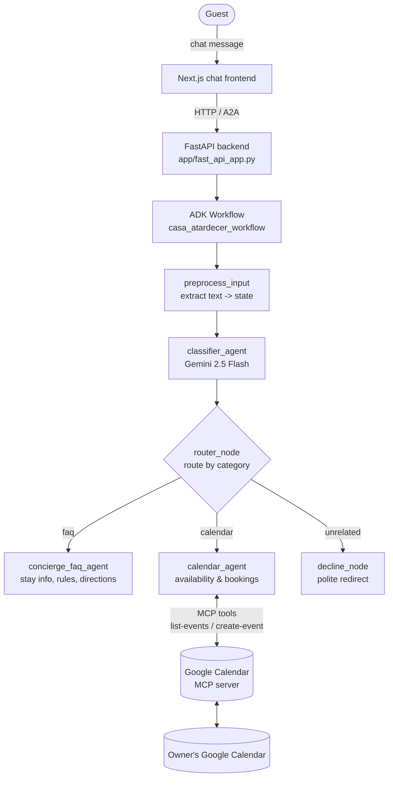

# Casa Atardecer Concierge

An AI concierge agent for **Casa Atardecer**, a rural vacation rental in Spain. Guests
ask free-text questions about their stay and the agent answers them, checks real
availability against the owner's calendar, and politely declines anything unrelated —
replacing a rigid button-and-rules flow with an agent that **reasons over natural
language**.

> Built for the **Kaggle 5-Day AI Agents: Intensive Vibe Coding Course with Google** capstone.
> Track: **Concierge Agents**. Team: Ana Aragón & Guillermo.
> Generated and managed with `agents-cli` on the **ADK** framework.

---

## The Problem

Small vacation-rental hosts answer the same questions dozens of times a week:
*"What time is check-in?" · "How do I get there?" · "Where are the keys?" ·
"Is the last week of August free?"*

Traditional automation for this is a **decision tree of buttons and keyword rules**.
It breaks the moment a guest phrases things their own way, mixes two questions in one
message, or writes in a different language — and it cannot answer *"are these dates
available?"* without a human opening the calendar. The result is slow replies, missed
bookings, and a host who is effectively on call 24/7.

## The Solution

A concierge agent that understands intent from free text and takes the right action:

- **Answers stay FAQs** (check-in/out, address, directions, keys, house rules, booking process) in the guest's own language.
- **Checks real availability** by reading the owner's Google Calendar, detecting overlaps, and refusing to double-book.
- **Stays on-topic**, politely declining questions unrelated to the stay.

### Why an agent (and not a chatbot / rules engine)?

- **Reasoning over rules** — it classifies intent from natural language instead of matching keywords, so it handles paraphrasing, typos, and mixed Spanish/English.
- **Tool use with guardrails** — the calendar agent *must* call `list-events` and check for overlaps **before** ever creating a booking, so it acts on live data instead of guessing.
- **Separation of concerns** — a router sends each message to a specialist agent, which keeps each prompt small, focused, and easy to evaluate.

---

## Architecture

The system has a **build-time** layer (how we develop it) and a **run-time** layer (what
serves guests).

**Run-time:** a Next.js chat frontend talks to a FastAPI backend that runs an **ADK
`Workflow`**. Every message is classified, routed to a specialist agent, and — for
availability questions — answered using the **Google Calendar MCP server** as a tool.



### Request flow

1. **`preprocess_input`** extracts the raw text from the incoming message and stores it in state.
2. **`classifier_agent`** (Gemini 2.5 Flash) labels the message as `faq`, `calendar`, or `unrelated` using a constrained output schema.
3. **`router_node`** forwards the original query to the matching branch.
4. The chosen specialist responds:
   - **`concierge_faq_agent`** — answers stay questions in the guest's language.
   - **`calendar_agent`** — reads the calendar via MCP, checks for overlaps, and only then confirms or rejects a booking.
   - **`decline_node`** — a deterministic node that politely redirects off-topic requests (no LLM call needed).

### How this maps to the course concepts

| Course concept | Where it lives | How we use it |
| --- | --- | --- |
| **Agent / Multi-agent system (ADK)** | [`app/agent.py`](app/agent.py) | An ADK `Workflow` orchestrating a classifier, a router, and three specialist agents. |
| **MCP Server** | [`app/tools.py`](app/tools.py) | The `calendar_agent` uses the **Google Calendar MCP server** (`@cocal/google-calendar-mcp`) via ADK's `McpToolset` to read and write real calendar events. |
| **Agent skills (Agents CLI)** | [`agents-cli-manifest.yaml`](agents-cli-manifest.yaml), project lifecycle | Project scaffolded, run, linted, and evaluated with `agents-cli`. |
| **Deployability** | [`Dockerfile`](Dockerfile) | Containerized FastAPI backend that runs on any container host (Cloud Run, Render, Railway, …). |
| **Security features** | `.gitignore`, `os.getenv` usage | No secrets in the repo: API keys and OAuth credentials are read from the environment and git-ignored. |
| **Antigravity** | Development workflow | Built with the Antigravity agentic IDE; project context lives in [`GEMINI.md`](GEMINI.md). |

### Tech stack

- **Agent framework:** Google ADK (`google-adk`) with Gemini 2.5 Flash
- **Backend:** FastAPI + A2A protocol support
- **Frontend:** Next.js + TypeScript
- **Tools:** Google Calendar via MCP (`McpToolset`)
- **Tooling:** `uv` for dependencies, `agents-cli` for lifecycle, Docker for deployment
- **Observability:** Cloud Trace, BigQuery, and Cloud Logging

---

## Project Structure

```
casa-atardecer-concierge/
├── app/                        # Core agent code
│   ├── agent.py                # Workflow: classifier + router + specialist agents
│   ├── tools.py                # Google Calendar MCP toolset
│   ├── fast_api_app.py         # FastAPI backend server
│   └── app_utils/              # Services, telemetry, A2A, typing helpers
├── frontend/                   # Next.js chat frontend
├── tests/                      # Unit, integration, and load tests
├── Dockerfile                  # Container build for deployment
├── GEMINI.md                   # AI-assisted development guide (Antigravity)
└── pyproject.toml              # Project dependencies
```

> 💡 **Tip:** Use the [Antigravity](https://antigravity.google/) agentic IDE for AI-assisted development — project context is pre-configured in `GEMINI.md`.

## Requirements

Before you begin, ensure you have:
- **uv**: Python package manager (used for all dependency management in this project) - [Install](https://docs.astral.sh/uv/getting-started/installation/) ([add packages](https://docs.astral.sh/uv/concepts/dependencies/) with `uv add <package>`)
- **agents-cli**: Agents CLI - Install with `uv tool install google-agents-cli`
- **Node.js**: Required for `npx` (runs the Google Calendar MCP server) and the Next.js frontend
- **Google Cloud SDK**: For GCP services - [Install](https://cloud.google.com/sdk/docs/install)


## Quick Start

1. **Clone the repository and install dependencies:**
   ```bash
   uvx google-agents-cli setup
   agents-cli install
   ```

2. **Configure environment variables:**
   Copy the example environment file and add your `GEMINI_API_KEY` (from Google AI Studio):
   ```bash
   cp .env.example .env
   ```

3. **Set up Google Calendar Integration (MCP):**
   Since the OAuth credentials file is ignored in version control, you need to create your own:
   * Go to the [Google Cloud Console](https://console.cloud.google.com/).
   * Enable the **Google Calendar API**.
   * Under **Google Auth Platform** (or OAuth consent screen), set the User Type to **External**, go to the **Audience** (Público) tab, and add your Gmail address to the **Test users** (Usuarios de prueba) list.
   * Under **Credentials**, create an OAuth Client ID of type **Desktop app**.
   * Download the JSON credentials file and save it in the root of the project as `gcp-oauth.keys.json`.
   * **Pre-authenticate** your calendar by running the following command once to open the browser consent screen and save your session locally:
     ```bash
     export GOOGLE_OAUTH_CREDENTIALS="$(pwd)/gcp-oauth.keys.json"
     npx @cocal/google-calendar-mcp auth
     ```

4. **Test the agent with the playground:**
   ```bash
   agents-cli playground
   ```

You can also use features from the [ADK](https://adk.dev/) CLI with `uv run adk`.

## Commands

| Command              | Description                                                                                 |
| -------------------- | ------------------------------------------------------------------------------------------- |
| `agents-cli install` | Install dependencies using uv                                                         |
| `agents-cli playground` | Launch local development environment                                                  |
| `agents-cli lint`    | Run code quality checks                                                               |
| `agents-cli eval`    | Evaluate agent behavior (generate, grade, analyze, and more — see `agents-cli eval --help`) |
| `uv run pytest tests/unit tests/integration` | Run unit and integration tests                                          |
| [A2A Inspector](https://github.com/a2aproject/a2a-inspector) | Launch A2A Protocol Inspector                        |

## 🛠️ Project Management

| Command | What It Does |
|---------|--------------|
| `agents-cli scaffold enhance` | Add CI/CD pipelines and Terraform infrastructure |
| `agents-cli infra cicd` | One-command setup of entire CI/CD pipeline + infrastructure |
| `agents-cli scaffold upgrade` | Auto-upgrade to latest version while preserving customizations |

---

## Local Development

### 1. Test Agent Logic Only (Playground)
To interact with the agent using the built-in ADK CLI dev UI, run:
```bash
agents-cli playground
```

### 2. Run Complete Application (FastAPI Backend + Next.js Frontend)
To run the full stack locally:

*   **Start the backend server** (runs on port `8000`):
    ```bash
    uv run uvicorn app.fast_api_app:app --port 8000
    ```
    *Note: The `.env` file at the root handles CORS configuration automatically.*

*   **Start the frontend server** (runs on port `3000`):
    ```bash
    cd frontend
    cp .env.example .env.local
    npm install
    npm run dev
    ```


*   **Open** [http://localhost:3000](http://localhost:3000) in your browser.

---

## Deployment

This project includes a standard [Dockerfile](./Dockerfile) at the root, allowing you to deploy the FastAPI backend to any container-supporting cloud provider (such as Cloud Run, Render, Railway, Fly.io, AWS, or DigitalOcean).

### How to Deploy (Render, Railway, etc.)

1.  **Build and test the container locally** (optional):
    ```bash
    docker build -t casa-atardecer-concierge .
    docker run -p 8080:8080 --env-file .env casa-atardecer-concierge
    ```
2.  **Deploy to your hosting provider**:
    - Connect your GitHub repository to your hosting provider (e.g., Render, Railway).
    - Configure the service to build from the root [Dockerfile](./Dockerfile).
    - Expose port `8080` (or your provider's default port).
    - Define your environment variables (like `GEMINI_API_KEY`) in the provider's Dashboard settings.

## Observability

Built-in telemetry exports to Cloud Trace, BigQuery, and Cloud Logging.

## A2A Inspector

This agent supports the [A2A Protocol](https://a2a-protocol.org/). Use the [A2A Inspector](https://github.com/a2aproject/a2a-inspector) to test interoperability.
See the [A2A Inspector docs](https://github.com/a2aproject/a2a-inspector) for details.

---

## Security

No secrets are committed to this repository:

- API keys (`GEMINI_API_KEY`) and OAuth credentials are read from the environment via `os.getenv` and provided through a git-ignored `.env`.
- The Google OAuth file (`gcp-oauth.keys.json`) and all `*-key.json` / `credentials*.json` files are excluded in [`.gitignore`](.gitignore).
- Copy `.env.example` to `.env` and supply your own values to run the project.
